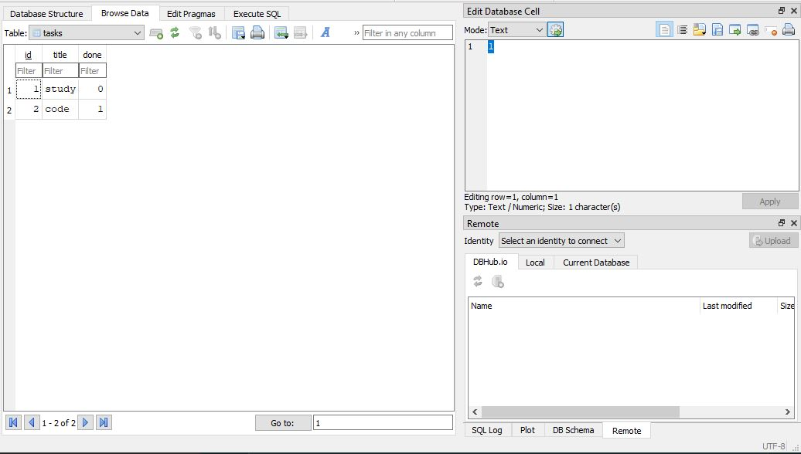
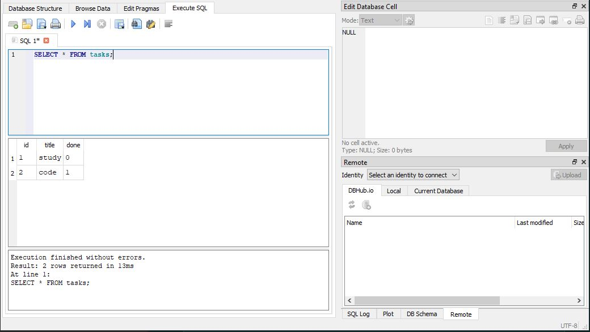

# Task API

A basic CRUD API built with Express.js

## Prerequisites

- Node.js 22+
- npm

## How to install and run it
> **Note:** Make sure you're in the project's root directory
```bash
npm install
npm start
```

Then you're good to go!

## Endpoints
| METHOD  | ENDPOINT     |
|---------|:-------------|
| GET     |`/`           |
| GET     |`/health`     |
| GET     |`/tasks`      |
| POST    |`/tasks`      |
| GET     |`/tasks/{id}` |
| PUT     |`/tasks/{id}` |
| DELETE  |`/tasks/{id}` |


## Example Output with curl

### Fetch all tasks
```bash
curl -i http://localhost:3000/tasks

HTTP/1.1 200 OK
X-Powered-By: Express
Content-Type: application/json; charset=utf-8
Content-Length: 123
ETag: W/"7b-ojSrUGqJZM9JbtKsOY+sK/nLsdk"
Date: Sat, 18 Jul 2026 16:25:49 GMT
Connection: keep-alive
Keep-Alive: timeout=5

[{"id":1,"title":"study","done":0},{"id":2,"title":"work on project","done":1},{"id":3,"title":"code","done":0}]
```
### Create a Task
```bash
curl -i -X POST http://localhost:3000/tasks -H "Content-type: application/json" -d "{\"title\":\"buy milk\"}"

HTTP/1.1 201 Created
X-Powered-By: Express
Content-Type: application/json; charset=utf-8
Content-Length: 36
ETag: W/"24-NQvTx2xYDvRTo0KgHzjkcR9JMv0"
Date: Fri, 24 Jul 2026 21:24:39 GMT
Connection: keep-alive
Keep-Alive: timeout=5

{"id":3,"title":"buy milk","done":0}
```

### Returns only completed tasks
```bash
curl -i http://localhost:3000/tasks?done=1

HTTP/1.1 200 OK
X-Powered-By: Express
Content-Type: application/json; charset=utf-8
Content-Length: 48
ETag: W/"30-VXBMCS1oBHC3TzQFmSmsIXwhGn8"
Date: Sat, 18 Jul 2026 17:28:52 GMT
Connection: keep-alive
Keep-Alive: timeout=5

[{"id":2,"title":"work on project","done":1}]
```

## Database Usage

This project uses SQLite for persistent storage. All data is stored inside a single database file (`tasks.db`).

The database file `tasks.db` is automatically created if it doesn't exist when the application starts.

## DB Browser

### Database table in the browser:



### Sample query in the browser:



## Interactive API documentation

Swagger UI is available at:
```bash
http://localhost:3000/docs
```


